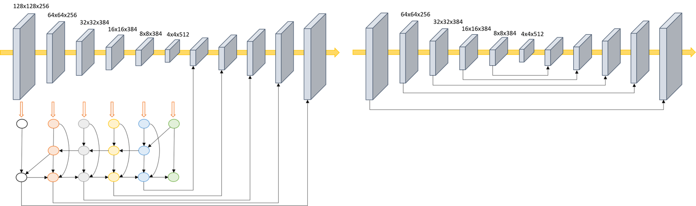

## Proposed Pest Detection
<li> Counting the number of pests is crucial for pest control. However, the size of pests varies, and their appearances in pictures can be diverse. </li>
<li> we propose a modified version of the hourglass, called BiFPN-Centernet, to preserve feature information for the diverse sizes of pests. </li>

## Proposed BiFPN-Centernet Architecture

## Expain Data
<li> The <a href="https://openaccess.thecvf.com/content_CVPR_2019/papers/Wu_IP102_A_Large-Scale_Benchmark_Dataset_for_Insect_Pest_Recognition_CVPR_2019_paper.pdf">IP102 pest dataset </a> is utilized for this experiment. </li>
<li> To obtain low-resolution images of pest photos, the existing IP102 data is downscaled by a factor of four to generate input images. </li>

## Training Environment
<li> python = 3.8.18 </li>
<li> pytorch = 1.9.1 + cu11.1 </li>
<li> GPU = NVIDIA GeForce RTX 3060 </li>
<li> CPU = Ryzen 5 5600X 6-Core Processor </li>
<li> epoch = 100 </li>
<li> batch = 5 </li>
<li> learning rate = 1.25e-4 </li>
<li> optimizer = Adam  </li>

## Evaluation

| Method | mAP |
| ------ | ---- |
| Centernet| 0.500| 
| BiFPN-Centernet| 0.530|
